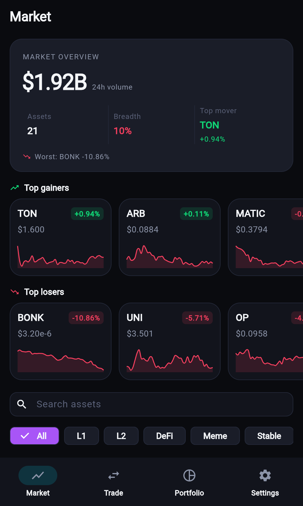
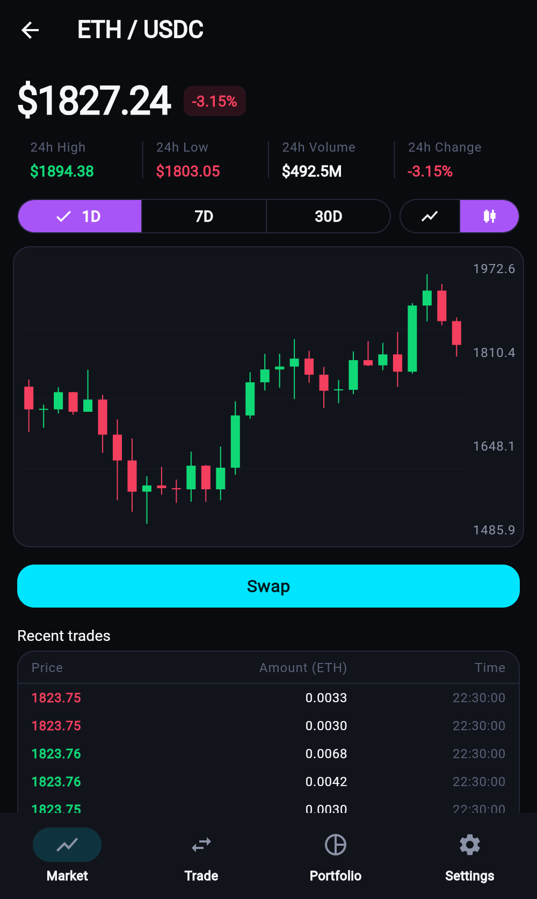
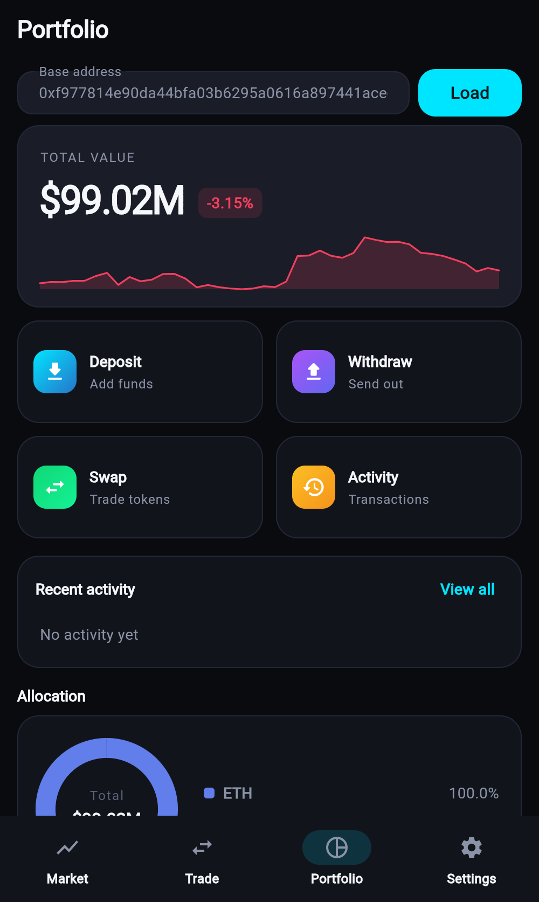
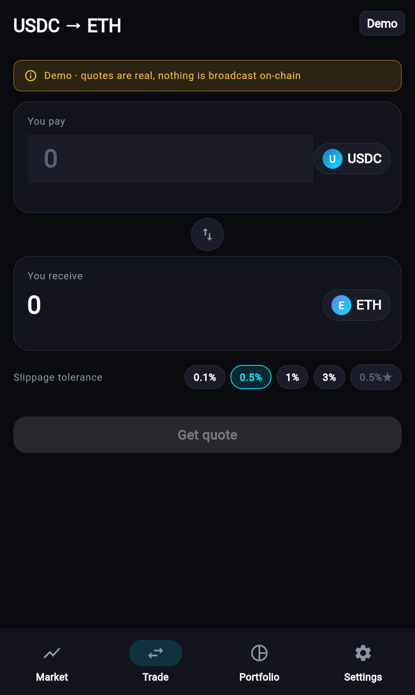
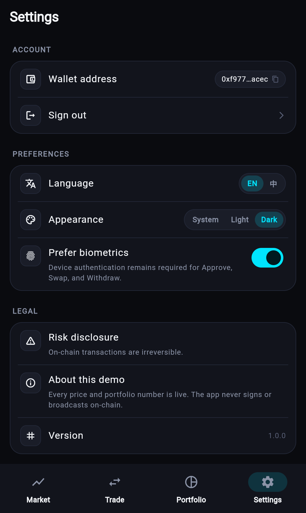

# DEX Demo

一个只读的去中心化交易所前端 demo，Flutter mobile + Cloudflare Workers。

我原本只想练一下 Flutter web3 相关的写法，做着做着就把 UI 铺满了 —— 现在看起来像那么回事。**所有数字都是实时的**，但确认按钮不签名、不广播，任何人拿到都不会误操作真钱包。

## 截图

| Market | Pair Detail | Portfolio |
|---|---|---|
|  |  |  |

| Trade | Settings |
|---|---|
|  |  |

## 数据来源

| 页面 | 数据 | 来源 |
|---|---|---|
| Market 列表（21 币）| 价格 / 24h 涨跌 / 成交量 / 24h 高低 | Binance `/ticker/24hr` |
| Market tile / 走势卡 | 7 天 sparkline | Binance `/klines` 4h |
| Pair 详情 K 线 | 1D / 7D / 30D OHLC | Binance `/klines` |
| Pair 详情最近成交 | 实时 tape | Binance `/trades` |
| Portfolio 余额 | ETH + USDC on Base | `mainnet.base.org` |
| Trade 报价 / route / gas | 汇率、min received、路由 | KyberSwap `/routes` |

- Confirm 按钮短路成 `Demo · not broadcast`，不签名。
- KyberSwap 只调 `/routes`（route-preview），不调 `/route/build`（不产 calldata）。
- Portfolio 的 24h 变化 pill 和 P&L 迷你线是按持仓 USD 权重合成上面这些真数据得到的。

## 页面亮点

**Market**
- Hero 卡：全市场 24h 总成交额、涨币占比、Top mover / Worst
- Top Gainers / Top Losers 两条横向滚动，卡片带 mini sparkline
- 分类 tab（All / L1 / L2 / DeFi / Meme / Stable）+ 搜索
- 21 币主列表，每行 sparkline + 24h 成交量 + 涨跌 pill

**Pair 详情**
- 大字价格 + 涨跌 pill
- 24h 高低量涨跌统计条
- 折线 ↔ 蜡烛切换，1D/7D/30D
- **蜡烛图带十字光标 + OHLC tooltip**（鼠标 hover / 手指按下）
- **折线图触摸 tooltip**（价格 + 时间）
- 最近 12 条成交 tape，买绿卖红
- "About XXX" 币种介绍段

**Portfolio**
- Hero：总值 + 24h 变化 pill + P&L 迷你趋势线
- 2×2 快捷操作卡（Deposit / Withdraw / Swap / Activity）
- **可交互 donut**：点 slice / legend 高亮，中心显示当前 slice 数值
- 每行持仓带图标、占比条、$价值
- Recent activity + Coming Soon 占位（DeFi Positions / NFTs）

**Trade**
- 双 Token 卡（Pay 输入 / Receive 只读 + shimmer）
- 中间圆形 flip 按钮
- 滑点 chip（0.1 / 0.5 / 1 / 3 % + 自定义）
- 完整报价详情：Rate / Min Received / Price Impact / Gas / Network Fee
- **路由可视化**：sell → hop pill → buy 横向节点图
- 报价倒计时进度条 + 秒数

**Settings**
- Account / Preferences / Legal 三段分组
- 钱包地址 chip 一键复制
- 语言 / 外观段控 chip
- Biometrics 开关

## 本地运行

```bash
# API（Cloudflare Worker）
cd apps/api
pnpm install
pnpm dev            # http://127.0.0.1:8787

# Flutter
cd apps/mobile
flutter pub get
flutter run         # 默认设备
```

Web 构建：

```bash
cd apps/mobile
flutter build web --release \
  --dart-define=API_BASE_URL=http://127.0.0.1:8787
python3 -m http.server 8090 --directory build/web
```

Client 通过 `API_BASE_URL`（build-time）指向 worker。默认 `http://127.0.0.1:8787`。

## Worker 环境变量

`apps/api/wrangler.jsonc` 已经带全部默认值，零配置就能跑起来。

| Var | 用途 | 默认 |
|---|---|---|
| `KYBERSWAP_CLIENT_ID` | KyberSwap 限流标识 | `dex-demo` |
| `MARKET_API_BASE_URL` | Binance base URL | `https://api.binance.com` |
| `ALLOWED_SETTLER` | 允许签名的 router 地址 | KyberSwap Base router |
| `CORS_ORIGINS` | 浏览器 origin 白名单，支持 `*.x.y` | 空 |
| `APP_ENV` | `mock` / `staging` / `production` | `mock` |
| `JWT_SECRET`, `SIWE_DOMAIN`, `SIWE_URI` | SIWE session，只有启用 `/v1/trades*` 才需要 | demo 里不用 |

## 测试

```bash
cd apps/api    && pnpm test        # 38 passed, 4 skipped
cd apps/mobile && flutter test     # 43 passed
```

Flutter 端测试包含 goldens：market / pair / portfolio / trade confirmation / deposit / transaction timeline，多分辨率 + 双语。

## 技术栈

- **API**：Cloudflare Workers · Hono · TypeScript · Vitest
- **Mobile**：Flutter · Riverpod v3 · Freezed · fl_chart · go_router · flutter_hooks
- **链读**：`web3dart` + Base 主网 RPC（`mainnet.base.org`）
- **行情源**：Binance public REST（ticker、klines、trades）
- **报价源**：KyberSwap Aggregator on Base

## 结构

```
apps/
  api/          # Cloudflare Worker
    src/
      market/   # /v1/markets, /v1/candles, /v1/sparklines, /v1/trades/recent
      swap/     # /v1/swap/{price,quote}
      auth/     # SIWE nonce/verify
      profile/  # authenticated /v1/profile
      trades/   # protected /v1/trades*
    test/
  mobile/
    lib/
      app/          # router, shell
      core/         # web3 rpc, api client, mock bootstrap, widgets
      features/
        market/     # market screen, pair detail, sparkline/candle
        trade/      # swap form, quote details, route viz
        portfolio/  # hero, donut, holdings, activity
        settings/   # grouped settings UI
        auth/       # sign-in scaffolding
      l10n/         # en / zh
      theme/        # dark web3 palette
    test/
```

## 说明

Demo 目的是把整个前端流跑通、把 UI 铺满 —— 不涉及真实钱包连接、签名、上链。要变成真能交易的东西还差几件事：接钱包（WalletConnect v2 或本地私钥）、KyberSwap `/route/build` 拿 calldata、`eth_sendRawTransaction` 广播、tx 状态轮询。当前所有能读取的链上/交易所数据都是真的。
